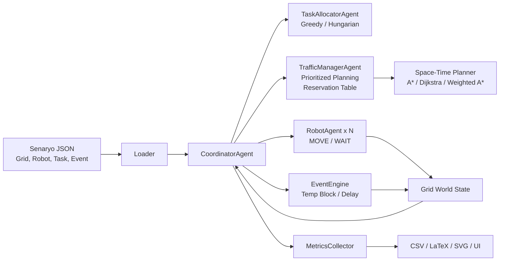

# Paper Architecture and RQ Plan

Bu dosya, makale yazımında doğrudan kullanılabilecek iki şeyi hazırlar:
- sistem mimarisi diyagramı
- araştırma sorusu (RQ) bazlı tablo planı

## 1. Mimari Diyagram

## 2. Makalede Mimariyi Anlatma Çerçevesi

Kısa anlatım önerisi:

1. `CoordinatorAgent` sistemin ana orkestratörüdür.
2. Her tikte önce görev atama yapılır.
3. Ardından seçilen mod ve varyanta göre rota planlama çalışır.
4. Robotlar `MOVE` veya `WAIT` aksiyonunu uygular.
5. Event engine dinamik blokaj veya gecikme etkisini uygular.
6. Metrics collector her koşunun performansını toplar.

## 3. Araştırma Soruları

### RQ1. Koordinasyon gerekli mi?
Soru: Bağımsız baseline ile koordineli yaklaşım arasında anlamlı fark var mı?

Kullanılacak suite:
- `python -m warehouse_sim.runner --suite main --latex`

Üretilecek tablo:
- `results/paper/main_comparison.csv`
- `results/paper/main_comparison.tex`

Tablo kolonları:
- Senaryo
- Mod
- Tamamlama Oranı
- Çakışma
- Makespan
- Throughput
- Bekleme
- Ortalama Görev Süresi

Beklenen anlatı:
- Koordineli mod, baseline'a göre çakışmaları ortadan kaldırır veya çok güçlü biçimde azaltır.
- Dar koridor, kavşak ve yüksek yük senaryolarında görev tamamlama oranı belirgin şekilde artar.

### RQ2. Daha adil baseline ve koordinasyon bileşenleri ne kadar etkili?
Soru: Naive baseline yerine daha adil bir static-priority baseline kullanıldığında tablo nasıl değişiyor ve full coordinated sistemin hangi bileşenleri kritik?

Kullanılacak suite:
- `python -m warehouse_sim.runner --suite coordination --latex`

Üretilecek tablo:
- `results/paper/coordination_ablation.csv`
- `results/paper/coordination_ablation.tex`

Tablo varyantları:
- `Bağımsız Baseline`
- `Öncelikli Baseline (Statik Öncelik)`
- `Koordineli (Edge Kapalı)`
- `Koordineli (Statik Öncelik)`
- `Koordineli (Tam)`

Tablo kolonları:
- Senaryo
- Varyant
- Mod
- Tamamlama Oranı
- Çakışma
- Makespan
- Throughput
- Bekleme

Beklenen anlatı:
- `Bağımsız Baseline` en zayıf referanstır.
- `Öncelikli Baseline`, naive baseline'dan daha adildir ve ikinci baseline olarak kullanılır.
- `Koordineli (Edge Kapalı)` varyantı, edge reservation'ın darboğaz ve yüksek yük altında kritik olduğunu gösterir.
- `Koordineli (Statik Öncelik)` ile `Koordineli (Tam)` farkı, dinamik önceliklendirmenin etkisini gösterir.

### RQ3. Görev atama politikasının etkisi nedir?
Soru: Coordinated mod altında greedy ve Hungarian atama ne kadar fark yaratıyor?

Kullanılacak suite:
- `python -m warehouse_sim.runner --suite allocator --latex`

Üretilecek tablo:
- `results/paper/allocator_ablation.csv`
- `results/paper/allocator_ablation.tex`

Tablo kolonları:
- Senaryo
- Atayıcı
- Makespan
- Throughput
- Toplam Yol
- Bekleme

Beklenen anlatı:
- Yüksek görev yoğunluğu veya darboğaz içeren senaryolarda Hungarian daha iyi toplam sistem davranışı sağlar.

### RQ4. Planner seçimi kalite ve maliyeti nasıl etkiliyor?
Soru: A*, Dijkstra ve Weighted A* arasında kalite-hız dengesi nasıl değişiyor?

Kullanılacak suite:
- `python -m warehouse_sim.runner --suite planner --latex`

Üretilecek tablo:
- `results/paper/planner_ablation.csv`
- `results/paper/planner_ablation.tex`

Tablo kolonları:
- Senaryo
- Planlayıcı
- Makespan
- Throughput
- Genişletilen Düğüm
- Planlama Süresi (ms)

Beklenen anlatı:
- `A*` ana sistem planlayıcısıdır.
- `Dijkstra` referans karşılaştırmadır.
- `Weighted A*` çoğu durumda benzer kaliteyi daha düşük planlama maliyetiyle sunar.

### RQ5. Dinamik olaylar altında sistem ne kadar dayanıklı?
Soru: Geçici blokaj ve stochastic delay altında coordinated sistem davranışını koruyabiliyor mu?

Kullanılacak suite:
- `python -m warehouse_sim.runner --suite robustness --seeds 11 17 23 31 37 --latex`

Üretilecek tablo:
- `results/paper/robustness.csv`
- `results/paper/robustness.tex`

Tablo kolonları:
- Senaryo
- Seedler
- Tamamlama
- Çakışma
- Makespan
- Throughput
- Bekleme

Beklenen anlatı:
- Dynamic obstacle senaryosu geçici blokaj altında yeniden planlama ihtiyacını gösterir.
- Stochastic delay senaryosu seed bazlı varyasyonu ve robustness davranışını gösterir.

## 4. Makale Ana Gövdesi İçin Tablo Seçimi

Ana gövdeye konulması önerilen tablolar:
1. `main_comparison`
2. `coordination_ablation`
3. `allocator_ablation`
4. `planner_ablation`

Appendix'e taşınması önerilen tablo:
1. `robustness`

## 5. Makale Figür Planı

Makale için önerilen figürler:
1. `swap_demo.svg`
2. `high_load_compare.svg`
3. `dynamic_obstacle.svg`
4. Bu dosyadaki mimari diyagram

## 6. Sunum Akışı Önerisi

1. Problem tanımı
2. Sistem mimarisi
3. Ana yöntem: reservation + prioritized planning
4. RQ1 ana sonuç tablosu
5. RQ2 koordinasyon ablation tablosu
6. Planner / allocator kısa destek analizi
7. Robustness appendix veya ek slayt
8. Sonuç ve sınırlamalar
